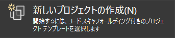
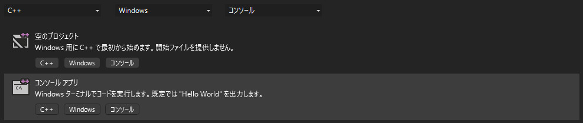
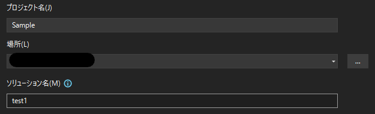
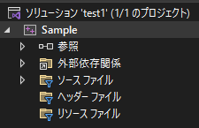
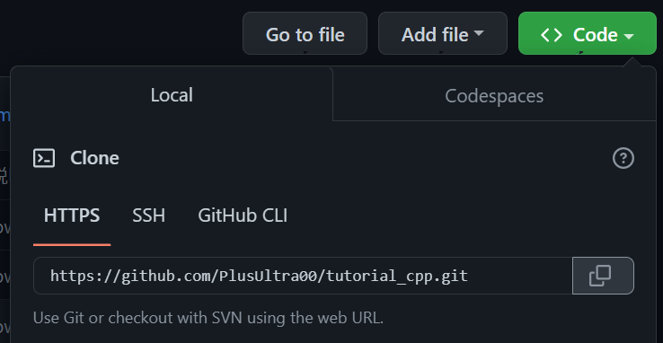
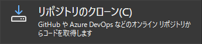
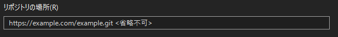

# Visual Studio の使い方
## インストール
**Visual Studio**を使用するためにはまず
**Visual Studio installer**をインストールしたのち，必要なコンポーネントを選択して**Visual Studio**をインストールする必要がある．
### Visual Studio installer のインストール
[Visual Studio: ソフトウェア開発者とチーム向けの IDE およびコード エディター](https://visualstudio.microsoft.com/ja/)へアクセスし以下のドロップダウンから **Community 2022** を選択

インストールされた **VisualStudioSetup.exe** を実行する．
### Visual Studio 2022のインストール

変更 をクリック

C++によるデスクトップ開発にチェックを入れ，**ダウンロードしながらインストール** をクリックし，しばらく待つ．
## プロジェクトの新規作成
新しいプロジェクトの作成をクリック

ドロップダウンリストでC++, Windows, コンソールを選択し，
コンソールアプリをクリックする．

プロジェクト名(ここではSample)，ソリューション名(ここではtest1)を入力し，**作成**をクリック

ソリューションエクスプローラーで下の画像のように表示されていれば成功．

## Gitリポジトリのクローン
[tutorial_cpp](https://github.com/PlusUltra00/tutorial_cpp)へアクセス．

リンクをコピーする．

Visual Studio 2022を起動する．

レポジトリのクローンを選択

リンクをペーストして **クローン** をクリック

## ソリューションエクスプローラー

ソリューションエクスプローラーではファイルの管理，作成，削除などが行える．
