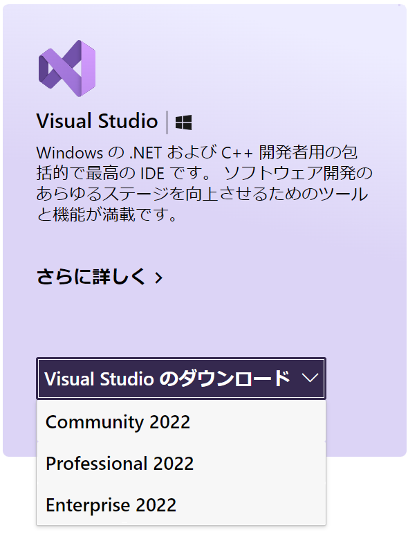
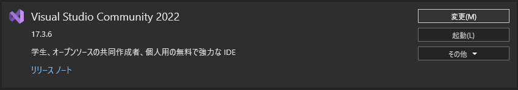
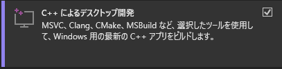
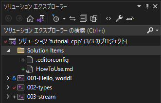

# Visual Studio の使い方
## インストール
Visual Studioを使用するためにはまず
Visual Studio installerをインストールしたのち，必要なコンポーネントを選択してVisual Studioをインストールする必要がある．
### Visual Studio installer のインストール
[Visual Studio: ソフトウェア開発者とチーム向けの IDE およびコード エディター](https://visualstudio.microsoft.com/ja/)へアクセスし以下のドロップダウンから **Community 2022** を選択

インストールされた **VisualStudioSetup.exe** を実行する．
### Visual Studio 2022のインストール

変更 をクリック

C++によるデスクトップ開発にチェックを入れ，**ダウンロードしながらインストール** をクリックし，しばらく待つ．
## solution explorer

ソリューションエクスプローラーではファイルの管理，作成，削除などが行える．
